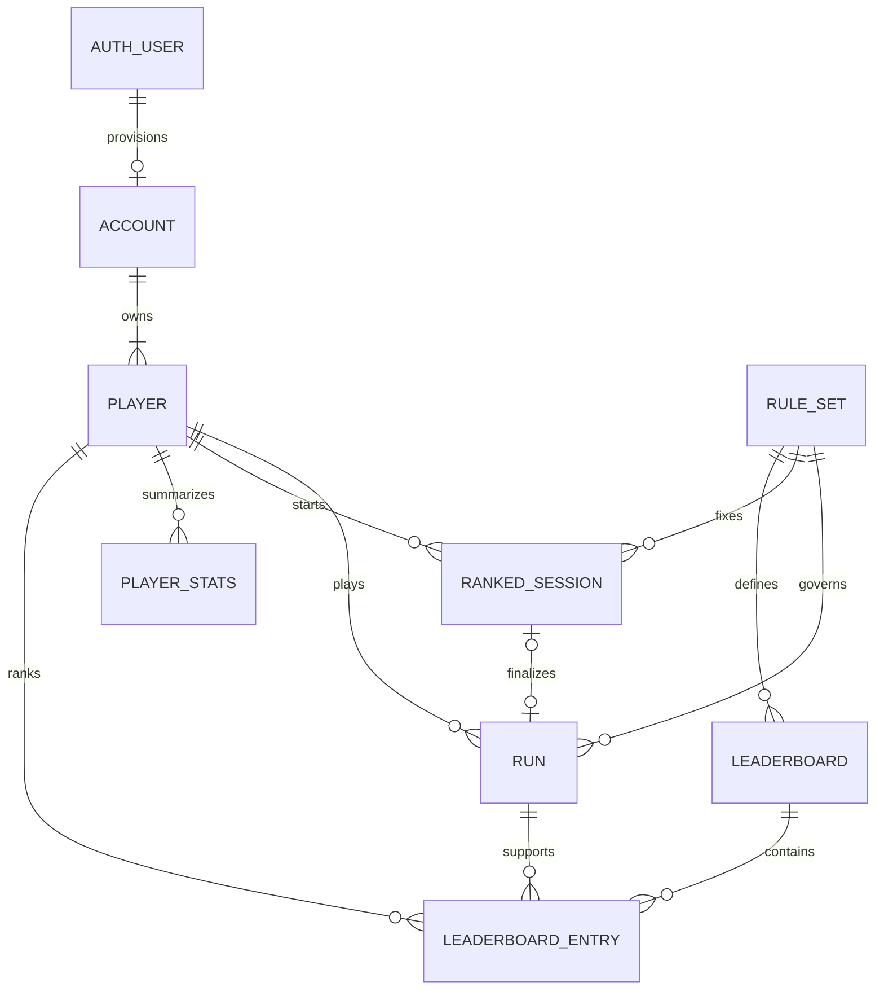

# calc-and-shot-beam：概念データモデル

2026-09-09。概念をFirestoreへ対応づけた設計案。以下のコレクションはまだ存在しない。アーキテクチャの全体方針は [architecture.md](architecture.md) を参照。

## 1. 中心となる概念

| 概念 | 何を表すか | 主な関係 |
| --- | --- | --- |
| Account | メールでログインする保護者等のアカウント | Auth UIDと1対1、Playerを1件以上所有 |
| Player | 実際に遊ぶ人。初版では1アカウントにつき1人 | Accountに所属、Runを複数持つ |
| RuleSet | 問題範囲、HP、制限時間、照準方式などの変更不可の版 | 複数のRun／Boardから参照 |
| Run | 1回のゲーム結果 | Playerに所属、RuleSetを参照 |
| RankedSession | ランキング挑戦のサーバー発行券 | Playerが開始、Runへ最大1回確定 |
| PlayerStats | プレイヤーの成績集計 | Player×成績条件ごとに1件、Runから再構築可能 |
| Leaderboard | 同じ条件で比較するランキング | RuleSet、難易度、操作方法、期間を固定 |
| LeaderboardEntry | そのランキング内でのプレイヤーのベスト | Board×Playerにつき最大1件、根拠Runを内部参照 |
| LocalGuest | 端末だけのゲスト | IndexedDB内。Auth Accountと同一概念ではない |

RuleSet／Leaderboardの参照先は論理上必須。Firestoreは外部キー制約を持つRDBではないため、Functionsで存在と所有関係を検証する。プレイヤーとランキング行の関係は内部管理し、公開データにAuth UIDや本人履歴パスを露出させない。

## 2. 保存先とフィールド案

### 認証と非公開領域

| 保存先 | 主なフィールド | 補足 |
| --- | --- | --- |
| Firebase Auth `/users/{uid}`相当（Firestoreではない） | uid、email、emailVerified、認証資格情報 | 認証の正本。アプリがパスワードを保存しない |
| `accounts/{uid}` | status: active/deleting、createdAt、updatedAt、schemaVersion | メール確認済み後に作成。公開しない |
| `accounts/{uid}/players/{playerId}` | nickname、avatarId、rankingOptIn、publicPlayerId、createdAt、updatedAt、schemaVersion | publicPlayerIdはサーバー生成のランダムID。初版1人、後から複数対応 |
| `accounts/{uid}/players/{playerId}/runs/{runId}` | ruleSetId、levelId、inputMode、mode、source、verification、destroyedCount、wrongHitCount、activeDurationMs、completedAt、receivedAt、rankedEligible、boardId nullable、schemaVersion | 本人履歴の正本。得点＝破壊枚数、得点フィールドを別に重複させない |
| `accounts/{uid}/players/{playerId}/stats/{statsKey}` | totalRuns、totalDestroyed、bestCount、lastPlayedAt、updatedAt、schemaVersion | 条件別集計。通常／検証済み／取り込みをstatsKeyで区別 |

メール未確認のAuthユーザーにはFirestore Accountがまだない。ログイン直後の `ensureAccount` はトランザクション等で二重作成を防止し、再実行でも同じPlayerを返す。`schemaVersion` は保存形式、`ruleSetId` はゲームルールの版であり、別の意味。

`source` は `member_play / guest_import`。`mode` は `practice / ranked`。`verification` は `unverified / validated / rejected`。`rankedEligible` はサーバーだけが導出する。`rejected` の詳細は本人用に短い理由コードを返す。インポート元の日時は `clientCompletedAt` として分け、サーバーの `receivedAt` を正規の保存時刻にする。

通常の実行IDは端末でUUIDを生成し、UID・Playerのスコープで冪等化。ゲスト取り込みは `guestInstallId + localRunId` 由来の安定キーを同じプレイヤー内で使用し、上書きや二重集計を防止する。ローカルIDだけでアカウントの所有権を判断しない。

### ルールと競技セッション

| 保存先 | 主なフィールド | 所有／参照 |
| --- | --- | --- |
| `ruleSets/{ruleSetId}` | revision、generatorVersion、operandMin/Max、sumMax、choiceCount、durationMs、cardHp、damagePerSecond、transitionMs、aimMethod、hintPolicy、pausePolicy、rankable | サーバー／管理者作成。使用後は不変、新版は新ID |
| `rankedSessions/{runId}` | ownerUid、playerId、ruleSetId、boardId、seed、startsAt、endsAt、submitBy、status、payloadHash、resultRef、createdAt | サーバー専用。Auth UIDとPlayer所属を固定 |
| `rankedSessions/{runId}/eventChunks/{chunkId}` | events、receivedAt | 必要な検証期間のみ保存するサーバー専用データ。初版は小さい上限なら単一chunk |

セッション状態は `issued → finalized / rejected / expired`。`submitBy`を過ぎた処理はアプリコードでも拒否し、削除処理の時刻に依存しない。提出後のイベントとハッシュは変更不可。同じrunId・同じハッシュは同じ結果、異なる内容での再提出は競合として拒否。

提出データの仮上限は128KB・2,000イベント。イベントは `problemIndex, choiceIndex, startMs, endMs, eventType` などの数値に限定。カメラ画像と関節座標は含めない。理論上の最大出題数をルールから求め、その件数分の問題生成が可能なseedを発行する。

### 公開ランキングと非公開の根拠

| 保存先 | 主なフィールド | 公開範囲 |
| --- | --- | --- |
| `leaderboards/{boardId}` | ruleSetId、levelId、inputMode、periodType: all-time、status: public/closed、title、updatedAt | 公開条件を満たすボードを取得可 |
| `leaderboards/{boardId}/entries/{publicPlayerId}` | nickname、avatarId、destroyedCount、achievedAt、updatedAt | 公開参加したプレイヤーのベストのみ |
| `accounts/{uid}/players/{playerId}/bestRuns/{boardId}` | runId、destroyedCount、achievedAt、publicPlayerId | 本人／サーバーのみ。公開行の根拠 |
| `accountDeletionJobs/{uid}` | status、cursor、startedAt、lastErrorCode | サーバー専用、削除の再開位置 |

公開行にメール、ownerUid、内部PlayerID、runId、自由記述のプロフィールは置かない。同じ `publicPlayerId` で複数の公開成績を関連付けられることは仕様上の公開範囲。ニックネームとアバターは表示用の複製で、変更時はCallableが該当行を更新する。

ランキング公開を停止する場合は、サーバーがPlayerを非公開にして既存公開行を削除する。完了するまでUIは「非公開への変更中」。処理中の結果投稿が行を再作成しないよう、同じPlayerの設定をトランザクションで読み、公開可否を再確認する。

### 端末内だけのデータ

IndexedDBのストア案：`guestProfiles`、`guestRuns`、`pendingMemberRuns`、`deviceSettings`。会員データは必ずUIDとPlayerIDをキーに含める。カメラ感度・左右校正は端末ごとに違うため、原則 `deviceSettings` に置く。

ゲストの保持件数は直近100件を初期案とし、古い記録の整理方針を画面に示す。クラウドに取り込んだ後も、保存成功を確認するまで端末データを削除しない。ゲストのまま端末変更した場合の復元は保証しない。

## 3. 書き込みAPIの責務

| Callable | 入力の概要 | 主な検証と更新 |
| --- | --- | --- |
| ensureAccount | 初期nickname／avatarId | メール確認、状態確認、Accountと初期Playerを冪等作成 |
| updatePlayer | playerId、nickname、avatarId、rankingOptIn | 所有者、許可フィールド、長さ、アバター一覧。公開行の同期 |
| savePracticeRun | playerId、runId、ruleSetId、結果 | 所有者、上限、重複。unverifiedなRunと通常Statsを保存 |
| importGuestRuns | playerId、少量のローカル結果 | 明示した取り込み、件数上限、重複。未検証履歴だけ作る |
| startRankedRun | playerId、選択した競技条件 | メール確認、公開参加、サーバーの許可ルール、同時セッション上限。seedと締切を発行 |
| finishRankedRun | runId、イベント、降格理由 | 所有者、期限、順序、得点再計算。Run／Stats／Best／Entryを更新 |
| deleteAccount | 再認証した本人の要求 | 削除中状態、公開行を先に除去、子データとAuthを削除 |

全APIでAuthとApp Checkを検証する。入力のUIDで他ユーザーを指定できない設計。削除中アカウントへの書き込みを拒否。長時間かかる公開行削除・名前同期・アカウント削除は小さい再試行可能なジョブへ分ける。

結果確定のトランザクションでは、最初にSession、Player公開設定、Run、Stats、Bestをすべて読み、その後に書く。集計の単純な「何度でもincrement」は使わず、未確定→確定の遷移と同じトランザクションで一度だけ加算する。最良値比較も同時更新に対応する。

## 4. 権限マトリクス

| データ | ゲスト／未確認ユーザー | 確認済み本人 | 別の会員 | Functions |
| --- | --- | --- | --- | --- |
| Account／Player／Run／Stats／Best | 不可 | 自分のパスをread | 不可 | 検証してread/write |
| 公開RuleSet | read | read | read | 管理処理のみwrite |
| 公開Board／Entry | read | read | read | 検証してwrite |
| RankedSession／イベント／削除ジョブ | 不可 | 直接不可、APIで必要情報だけ取得 | 不可 | read/write |
| クライアントからのFirestore write | 全拒否 | 全拒否 | 全拒否 | Admin SDK経由 |

Rulesは上記の許可パス以外を既定拒否。本人パスの読み取りでは `request.auth.uid == uid` と `email_verified == true` を確認。公開Entryを読む場合も親Boardが公開中か検証する。メール確認前後、別UID、深いサブコレクション、未知パス、直接得点更新の各ケースをテストする。

## 5. 画面の取得クエリとインデックス

| 画面 | 取得案 | インデックス方針 |
| --- | --- | --- |
| プレイヤー一覧 | 自分の `accounts/{uid}/players` | createdAtの単一フィールド |
| 最近の記録 | 自分の `.../runs`、completedAt降順、limit 20 | 単一フィールド、ページ送り |
| 難易度別記録 | 同じパス、levelId一致＋completedAt降順 | levelId ASC、completedAt DESCの複合 |
| 成績 | 条件を表すstatsKeyの直接get | 追加不要 |
| ランキング | 公開Board配下entries、destroyedCount降順＋achievedAt昇順、limit 50 | destroyedCount DESC、achievedAt ASCの複合 |
| 自己ベスト | 自分のbestRuns/{boardId}を直接get | 追加不要 |

`firestore.indexes.json` とクエリ・Rulesテストを同じ変更に含める。必要なら安定したページ送りの最終キーにdocument IDを使い、実クエリに合わせてインデックス定義を確認する。全ユーザーのRunをクライアントで集めてランキングを算出しない。毎回50件をリアルタイム購読する方式も初期要件にしない。

同点順位は上位一覧から表示できる。圏外の正確な全国順位は別の集計設計が必要なので、初版は自己ベストと「上位50件」を表示する。

## 6. 保持・削除・変更

- 会員履歴・ベストはアカウント削除まで保持する案。具体的なサービス利用方針と容量を見て確定する。
- ランキング提出の検証イベントは7日程度、期限切れセッションは短期保管を初期案とする。保持期間は実装前に設定値化する。Runの要約とベストの根拠は残す。
- 保持期限で消す場合もサブコレクションを含む掃除を明示的に行う。親文書だけの削除に依存しない。
- ルール変更は新しいruleSetId／boardId。過去のRunが参照するルールを上書きしない。
- アカウント削除は公開行、子コレクション、セッション、端末内会員キャッシュの扱いまで含める。再試行しても結果が同じになるようにする。
- PublicEntryとStatsは派生データ。必要なら保存済みRunから再集計できるが、unverifiedなゲスト取り込みをvalidatedへ格上げしない。

## 7. 検証すべき不変条件

1. 同じRunの再送で履歴・集計・ランキングが二重にならない。
2. 非公開プレイヤーの公開行が新規作成されない。
3. 別の保護者が子供の記録を読めず、保存先を指定し直しても書けない。
4. メール未確認者はクラウド保存・ランキング投稿ができない。
5. 異なる難易度・入力方式・ルール版の結果を同じランキングへ載せない。
6. 通信失敗で既存の記録を消したり、空一覧として上書きしない。
7. 削除中に新しい記録や公開行を作れず、途中失敗後の再実行で削除を完了できる。
8. クライアントの申告得点を直接採用せず、ランキング更新はFunctionsだけが行う。
