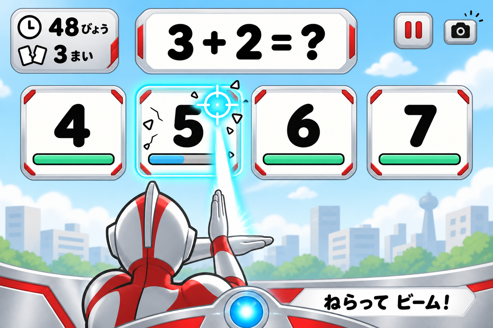

# たしざんビーム：素材制作からWebアプリ完成までのロードマップ

| Loop | Task | User-facing summary | Unit test | Refactor checkpoint |
| --- | --- | --- | --- | --- |
| 01 | 独立した開発環境 | 新ゲームを既存作品と分けて準備する。 | 起動確認、単体は対象外 | ESMと実行コマンド |
| 02 | 出題設定 | 1桁同士の足し算の範囲を決める。 | problem | 設定と生成を分離 |
| 03 | 4択生成 | 必ず正解が1枚だけある4択にする。 | choices | 乱数を注入 |
| 04 | 時計 | 本番の持ち時間を60秒にする。 | clock | 描画から独立 |
| 05 | 命中と破壊 | 正解だけHPが減り、破壊で得点する。 | damage | 演出から独立 |
| 06 | 進行状態 | 出題・破壊・次問・結果をつなぐ。 | session | 入力可能状態を明示 |
| 07 | 仮画面とタッチ | 四角形のカードで最後まで遊べるようにする。 | input | 入力経路を統一 |
| 08 | カメラ接続 | カメラの準備中や失敗をわかりやすくする。 | camera | 開始・終了を対にする |
| 09 | 姿勢の整形 | 左右反転と座標のずれを解消する。 | pose | 身体比率で正規化 |
| 10 | 照準 | 小さな身体の動きで4枚を狙えるようにする。 | aim | 判定と描画を分離 |
| 11 | 発射ポーズ | 腕を組むとビームを出す。 | gesture | 判定値を設定へ |
| 12 | 認識の復帰 | 認識が途切れても遊びを再開できるようにする。 | recovery | 古い入力を破棄 |
| 13 | 操作の親子試遊（スキップ） | ユーザー指示により実施しない。 | 関連単体のみ確認済み | 実人物の操作性は未確認 |
| 14 | UIレイアウト | 数字を隠さずヒーローを手前に置く。 | layout | 領域とCSSの責務 |
| 15 | 素材仕様書 | 必要な画像のサイズと位置をそろえる。 | 対象外・仕様レビュー | 素材IDを固定 |
| 16 | 背景素材 | 数字が読みやすい明るい街を作る。 | 対象外・画像確認 | 背景とUIを分離 |
| 17 | 後頭部素材 | 手前に見えるヒーローを作る。 | 対象外・画像確認 | 共通の基準位置 |
| 18 | 待機腕素材 | 構える前の腕を作る。 | 対象外・画像確認 | 共通の基準位置 |
| 19 | 発射腕素材 | 光線ポーズの腕を作る。 | 対象外・画像確認 | ビーム発射点を固定 |
| 20 | 素材取り込み | 背景・身体・腕を重ねて表示する。 | assets | 読み込みを集約 |
| 21 | ビーム演出 | 手前の腕からカードまで光線を伸ばす。 | effects | ダメージと描画を分離 |
| 22 | バリアと破壊 | 当たりと間違いを見た目で伝える。 | feedback | 演出時間を設定へ |
| 23 | 効果音制作 | 発射・バリア・破壊などの短い音を作る。 | 対象外・試聴 | 音量を統一 |
| 24 | 音の組み込み | 開始操作で音を有効にし、消音もできるようにする。 | audio | 音源の停止と再利用 |
| 25 | 開始・練習・結果 | 初めてでも遊び方がわかる画面を作る。 | screens | 文言を集約 |
| 26 | 一時停止 | 中断後に同じ問題から再開できるようにする。 | pause | 時計と認識を同期 |
| 27 | 画面サイズ調整 | PCと横向きタブレットで読みやすくする。 | layout＋実画面 | ゲーム専用CSS |
| 28 | 一連の自動確認 | 正解・誤答・終了までを通して確認する。 | 全単体＋E2E | 重複fixtureを整理 |
| 29 | 実機性能確認 | ビームとカメラが重くないか確認する。 | 全単体＋手動 | 描画品質を設定化 |
| 30 | 完成版の親子試遊 | 60秒を楽しく最後まで遊べるか確認する。 | 関連単体＋手動 | 修正を1件ずつ分割 |
| 31 | 公開準備 | 配信するファイルと復旧方法を整える。 | 全単体＋配信確認 | 配信対象を限定 |
| 32 | HTTPS公開確認 | 公開URLでカメラ・音・再プレイを確認する。 | 全単体＋公開確認 | READMEと実態を一致 |

## 1. ゴールとスコープ

### 進捗（2026-09-14更新）

- **Loop 26〜28：実装・自動検証済み**。停止理由・重複停止・即時の音停止、44px操作領域、5画面サイズ、6シナリオのE2Eを追加。単体80件、E2E6件成功。[Loop 26〜29検証記録](../../docs/loop26-29-verification.md)。未デプロイ。
- **Loop 29：PC Chrome代替操作の計測を実施、実カメラ確認は残件**。headless・キーボードで実時間60秒×3回を計測。身体認識遅延・iPad Safari・実機試聴は未確認。実機確認全体の完了とはしない。

- **Loop 01：完了**。ユーザー指示により追加の環境分離は行わない。既存のESM構成・静的ページ・Hostingを使用。初回公開済み。p5導入・画面接続はLoop 07で実施する。
- **Loop 02：完了**。`public/js/game/problem-settings.js` と `problem.js` を追加。初期設定は両加数1以上・合計5以下、全範囲設定は0〜9＋0〜9。有限の候補から問題を生成する。
- **Loop 03〜07：完了**。4択生成・60秒時計・HP／得点・進行状態・マウス／タッチの仮画面を実装。p5.js 2.2.2を同梱し、仮背景とビームを描画する。
- 検証：`npm test` の20テスト成功。Chromeで誤答→正解破壊→次問→実時間60秒→結果→再プレイ、タッチ長押しを確認。詳細は [Loop 07検証記録](../../docs/loop07-verification.md)。
- 一時停止・タブ非表示時の停止はLoop 07で先行実装。Loop 26〜28で身体入力・音との統合を自動検証した。
- ローカル画面へ接続済み。2026-09-10にLoop 07までを本番Hostingへ公開し、4択・正解長押しで得点・一時停止・p5描画を確認。カメラ・音・正式画像の組み込みは後続。
- **Loop 08：実装済み**。映像のみ取得、ml5.js 1.3.0／MoveNetの非同期読込、準備・失敗表示、再試行、タッチ復帰、停止・遅延完了時の資源解放を追加。単体30テスト成功。検証範囲と実カメラ確認状況は [Loop 08検証記録](../../docs/loop08-verification.md)を参照。今回の変更は未デプロイ。
- **Loop 09：実装済み**。鏡写しとレターボックスを含む座標変換、肩幅による身体座標の正規化、低信頼度・古い結果の除外、プレビューの関節表示を追加。単体39テスト成功。合成映像によるブラウザ検証で目印の位置一致と消去を確認。[Loop 09検証記録](../../docs/loop09-verification.md)。物理カメラでの位置合わせは未確認、未デプロイ。
- **Loop 10：実装済み**。両肩中心の中央校正、肩幅基準の可動範囲、時間ベースの平滑化、カードへの吸着と境界の揺れ防止、4枚の練習表示を追加。単体47テスト成功。腕組みの模擬姿勢で全4枚に到達し、練習中のゲーム状態保持を確認。[Loop 10検証記録](../../docs/loop10-verification.md)。実人物の操作性は未確認、未デプロイ。
- **Loop 11：実装済み**。肩幅基準の腕組み判定、250ms保持、解除・再発射、身体入力から実ゲームへの接続を追加。開始時・次問・認識喪失後は腕をほどく操作が必要。単体55テスト成功。ブラウザの模擬姿勢でバリア・2枚破壊・タッチ復帰後の得点を確認。[Loop 11検証記録](../../docs/loop11-verification.md)。実人物の認識精度は未確認、未デプロイ。
- **Loop 12：実装済み**。短い認識喪失では発射停止、約1秒で自動一時停止。腕をほどいて認識が3秒続くと同じ問題・HP・得点から再開。カウントダウン中の再喪失や手動停止・タッチ切替で再開を取り消す。単体62テスト成功。[Loop 12検証記録](../../docs/loop12-verification.md)。実人物の試遊は未確認、未デプロイ。
- **Loop 13：ユーザー指示によりスキップ**（2026-09-11）。実人物での操作性・成功率・誤発射数は未確認。[試遊手順と記録表](../../docs/playtest.md)は参考として保存。試遊結果を待たずLoop 14へ進む。
- **Loop 14：実装済み**。横向き1600×900・縦向き900×1600の共通座標で式・HUD・4カード・仮の主人公と腕を配置。数字を避けるビーム経路を実装。単体66テストと6画面サイズのChrome検証に成功。[Loop 14検証記録](../../docs/loop14-verification.md)。正式素材は後続Loop、未デプロイ。

2026-09-09作成。今回の会話で合意した画面を、親子でブラウザから遊べる完成品にする計画。**本書作成時点では、実装・素材分解・ゲームの試験・公開は未実施**。

参考画像は生成済みのデザイン案を本計画と一緒に保存したもの。これを背景1枚として使わず、数字・カード・HP・照準は可変表示に作り直す。

### 完成時の体験

- スタート → カメラ準備／練習 → カウントダウン → 60秒の本番 → 破壊枚数の結果 → もういちど。
- 上中央に `3 + 2 = ?`、中央に `4 / 5 / 6 / 7` の4択、左上に残り時間、その下に破壊枚数。
- 手前に主人公の後頭部と腕。画面下の腕から中央のカードへ光線が伸びる。描画上は肩越しの視点で、カメラに背を向ける必要はない。
- 狙ったカードにポーズでビームを当てる。正解カードだけHPが減り、壊れたら1点と次問。不正解はバリアでHPが減らない。
- 銀・赤・青を基調に、数字を大きく、文字を少なくする。認識入力もタッチ入力も同じゲームルール。

### 初版の範囲

PC＋Webカメラを主対象、横向きタブレットを副対象とする。カメラは一人を認識し、最初の公開はFirebase Hostingでのゲスト利用とする。将来はメール確認済み会員のクラウド保存・ランキングを追加するため、[Firebaseアーキテクチャ](../architecture.md)と[追加計画](firebase-account-records-plan.md)に沿って認証・保存の境界を分ける。タッチ／マウスでも完走可能にする。スマートフォン縦向きのタッチ表示も確認するが、身体操作の使いやすさは初版の必須条件にしない。

「1桁の足し算」は **0〜9 + 0〜9（答え0〜18）** を扱える問題生成にする。初回推奨は両方1以上・合計5以下、4択は維持。保護者設定で全範囲へ変更できるようにし、子供向けのレベル選択画面・引き算・対戦・収集要素は完成後の拡張とする。

### 確認した既存構成

- `5_games/number-monsters/PLAN.md` はCPU対戦・2択・シールドの別企画。今回の進行ルールには取り込まない。
- `5_games/squat-maze/public/js/game/pose-tracker.js` にBodyPose初期化とキーポイント取得の参考実装がある。停止・失敗処理を含め、そのまま流用できると判断したわけではない。
- 同ゲームの `public/game.html` はp5 2.2.2、ml5の可変指定 `@1` を参照している。
- `5_games/_template/` はFirebase Auth／Firestoreを含む。今回は静的ゲームとして必要部分だけ参照し、DB・認証を複製しない。
- プロジェクトの管理先は、ユーザーが作成した **`5_games/calc-and-shot-beam/`**。ロードマップ・参考画像・今後のコード・素材・テスト・公開設定をこのフォルダ内で管理する。

## 2. 前提・リスクと仕様の仮決め

### 最優先：狙う動きと発射ポーズを両立させる

初期案は、**両肩の中心の左右移動で照準を動かし、両腕を組むと撃つ**方式。胸の前で腕を組んでも照準を操作できる。4択を横一列にし、縦方向の狙いは自動でカード列に合わせる。カメラから得た関節の奥行き方向をそのままレーザー方向にする仕様にはしない。

最初に中央姿勢と無理のない左右移動を測定し、子供の身長・肩幅に合わせて操作範囲を調整。カードへの吸着、境界のヒステリシス、座標の平滑化を加える。動く量が大きい場合は感度を上げる。

これで狙いにくい場合の代案は「片手で照準を合わせて短く保持 → そのカードをロック → 腕を組んで発射」。Loop 13はスキップしたため、現在の方式で素材と本UIを進め、比較は必要になった時点で行う。どちらも最初から正解カードを教える表示にはしない。

### 初期調整値（すべて試遊で変更可能）

| 項目 | 初期値・仕様 |
| --- | --- |
| 発射ポーズ | 肩・肘・手首の位置から胸前の交差を判定。左右反対も許容、約250ms保持 |
| 発射中 | ポーズ保持中は連続ビーム。HP100に対して毎秒125ダメージ、約0.8秒で破壊 |
| 誤答 | バリア表示のみ。減点・HP回復・時間追加ペナルティなし |
| 次問 | 破壊演出約0.35秒。次の発射には一度腕をほどく操作を要求し、撃ちっぱなしの連続破壊を防ぐ |
| HP | 1問につき正解カード1枚のみ減少、命中が外れた間は維持。問題更新時だけ全カードを初期化 |
| 得点 | HPが0になった時点で1点。二重加算禁止 |
| 制限時間 | 本番開始から60秒の有効プレイ時間。通常の破壊演出中も進む |
| 終了境界 | 有効時間が60秒未満の破壊のみ加点。遅れて到着した姿勢結果や演出からは加点しない |
| 中断 | 手動停止・タブ非表示・長い認識喪失は時計を止める。準備／練習にも本番時間を使わない |
| 認識喪失 | 短い途切れは発射停止、約1秒続けば自動一時停止。古い結果を使って撃たない |
| 復帰 | 問題・HP・得点を保持。準備完了後に短い再開カウントダウン |
| タッチ | カードを押している間だけ発射。離す／キャンセルで停止、次問は再押下が必要 |

端末速度によらない経過時間ベースのHP計算を用いる。表示は残秒の切り上げ、判定は単調増加時計の実数値とし、フレーム数や `setInterval` の回数で60秒を数えない。

上記の停止ルールは通常プレイ用。将来のランキング挑戦ではサーバー発行の60秒を使い、中断時はランキング対象外の通常プレイへ移行する案とする。詳細はFirebaseアーキテクチャを参照。

### 技術構成と未確認事項

- HTML/CSS：スタート・ボタン・保護者設定・結果など。p5.js：ゲーム描画、合成、ビーム、粒子。ml5.js BodyPose：姿勢推定。ゲーム判定は依存のないJavaScriptへ分離。
- ESMで構成。まず既存のp5 2.2.2を候補として、ml5との組み合わせを小さな実機ページで確認し、両方を**具体的バージョンで固定**。現時点で推奨最新版や互換性検証済みとはしていない。
- p5 2系では非同期初期化を使う方針。根拠：[ml5公式のp5 2対応説明](https://ml5js.org/blog/using-ml5-with-p5-2/)。BodyPoseの参照：[ml5公式サンプル](https://editor.p5js.org/ml5/sketches/hMN9GdrO3)。古いサンプルの初期化方式を混在させない。
- カメラは映像のみ、マイク不要。ローカルまたはHTTPSで確認する。根拠：[p5 createCapture公式](https://p5js.org/reference/p5/createCapture/)。録画・映像送信は実装しない。モデルやライブラリの取得通信と映像の送信を区別してネットワーク確認する。
- MoveNetを最初の候補とするが、腕の交差時に肘・手首が隠れる可能性がある。Loop 13はスキップしたため認識率の実測は未確認。端末性能は後続の実機確認で計測し、必要に応じて判定の許容幅やモデル選択を見直す。
- カメラ拒否、モデル読込失敗、音声再生失敗でも、理由と代替操作を表示。読み込み待ちで無期限に止めない。
- 初版は2D素材＋プログラムによる演出。Blender・3Dモデル・大量の動画制作を前提にしない。
- 公開用の素材制作方針は、銀赤青のヒーロー感を維持したオリジナルデザインを仮置きする。今回の参考画像を公式素材として扱わず、キャラクター・音・フォントの出典と利用条件を素材台帳に記録する。

## 3. 段階別ロードマップと詳細ループ

### マイルストーン・時間の見方

| 段階 | 対象Loop | 見える成果・通過条件 | 作業量の目安 |
| --- | --- | --- | --- |
| A：遊びの芯 | 01〜07 | 仮カードとタッチで60秒完走。正解・誤答・得点が正しい | 0.5〜1日 |
| B：身体操作 | 08〜13 | 子供が4枚を狙い、意図したタイミングで撃てる | 1〜2日＋試遊 |
| C：見た目と素材 | 14〜20 | 参考画像の構図で、数字やHPが動く | 1〜2日 |
| D：気持ちよさ | 21〜27 | 光線・バリア・破壊音・練習・結果までそろう | 1〜2日 |
| E：完成確認 | 28〜32 | 実機試遊とHTTPS公開確認を通過 | 1〜3日 |

一人で作業する場合の暫定目安は**実働5〜10日程度＋親子試遊・画像生成・公開先準備の待ち時間**。1日4〜6時間程度を想定した幅のある見積もりで、確約ではない。身体認識の調整が最大の変動要因。各Loopは15分以下の「1回の変更・確認単位」であり、1行だけでその領域全体が完成する見積もりではない。失敗・素材修正・端末差が出たら、同じ段階内に15分以下の追加Loopを切る。

### 全Loop共通の実行方法

実装ループは、対象テストを失敗させる → 最小実装 → 対象テスト実行 → リファクタリング → 変更した場合だけ再実行。`.agent/rules/esm-compatibility.md` に沿ってESMを使う。CSSはゲームディレクトリ内で責務別に分け、他作品のCSSを変更しない。変更ファイルに応じたlintを行い、TS/Vueを追加する場合は `.agent/rules/lint-after-code-change.md` の変更ファイル限定指定に従う。

以下のファイルは **実装先 `5_games/calc-and-shot-beam/` からの相対パス**。各Loopの実施状況は上記の進捗と検証記録を参照。`type: module` とNode組み込みテストの `npm test` を導入済み。単体は実際には `tests/unit/` に置き、個別実行は `node --test tests/unit/<名前>.test.js`。後続Loopの `tests/<名前>.test.js` は仮パスとして読み替える。`npm run test:e2e` はLoop 28で導入済み。

画像生成・音制作・手動試遊・公開だけのLoopに形式的な単体テストは作らない。表の「対象外」は明示的な例外で、画像確認・試聴・実機結果を完了条件とする。複数の素材を1回で作り切ろうとせず、1素材／1修正ずつ進める。

### A：仮素材でルールを完成させる

**01｜開発環境：完了（ユーザー指示で範囲調整）**：既存の `package.json`、`public/index.html`、Hostingを使用し、追加の環境分離は行わない。静的ページのローカル配信と初回公開を確認済み。Node組み込みテストの `npm test` を用意。p5導入と描画確認はLoop 07へ移す。

**02｜問題：完了（01後）**：`tests/unit/problem.test.js` に境界・範囲・不正設定を先に追加し、実装前の失敗を確認。`public/js/game/problem.js` と `problem-settings.js` を実装。確認：`node --test tests/unit/problem.test.js`。設定と生成を分離し、乱数を注入可能にした。完了：5テスト成功、画面接続は後続。

**03｜4択（02後）**：`choices.test.js` に重複なし・正解1枚・端の答え0/18・正解位置の入替を追加。`choices.js` に有限の候補集合から抽出する処理を追加。確認：`node --test tests/choices.test.js`。乱数を注入し再現可能に。完了：4枚が必ず作られ、再抽選の無限ループがない。

**04｜時計（01後）**：`clock.test.js` に開始前、59.999秒、60秒、停止時間除外を追加。`clock.js` に時計の注入を実装。確認：`node --test tests/clock.test.js`。描画処理を持たせない。完了：時間境界と再開が一致。

**05｜ダメージ（03・04後）**：`damage.test.js` に正解のみ減少、誤答不変、同じ経過時間で同じHP、二重加点防止を追加。`damage.js` に適用区間と下限0処理を実装。確認：`node --test tests/damage.test.js`。演出から切り離す。完了：低FPSでも過剰ダメージがない。

**06｜進行（05後）**：`session.test.js` に破壊→次問、時間切れ、終了後無入力、次問の再発射条件を追加。`session.js` に状態遷移を実装。確認：`node --test tests/session.test.js`。得点更新箇所を一つに。完了：終了と破壊の競合が仕様どおり。

**07｜仮画面・入力（06後）**：`input.test.js` に押下・離す・キャンセル・次問への持越し禁止を追加。`public/js/input/pointer.js` と仮描画を作成。確認：`node --test tests/input.test.js` と60秒の手動プレイ。入力を共通イベントへ変換。完了：カメラなしで最後まで遊べる。

### B：身体操作を先に検証する

**08｜カメラ：実装済み（07後）**：`tests/unit/camera.test.js` に成功・拒否・読込タイムアウト・終了時停止・再試行競合を追加。`public/js/input/camera.js` で映像のみ取得とライフサイクルを管理し、`body-pose.js` にモデル読込、`ui/camera-panel.js` に状態表示を分離。確認：`node --test tests/unit/camera.test.js`。実カメラの確認状況は検証記録を参照。失敗時もタッチで再開でき、終了後カメラを解放する。

**09｜姿勢整形：実装済み（08後）**：`tests/unit/pose.test.js` に左右反転、縦横の余白、肩幅基準、低信頼度、古い・逆順・未来の時刻を追加。`public/js/input/pose-normalizer.js` で共通座標へ変換。カメラは推論開始時刻と座標寸法を通知し、`ui/pose-preview.js` で映像と同じ位置に肩・肘・手首を描画。確認：`node --test tests/unit/pose.test.js`、`npm test` とブラウザ検証。合成映像では表示位置と左右の一致を確認。実カメラでの確認状況は検証記録を参照。

**10｜照準：実装済み（09後）**：`tests/unit/aim.test.js` に中央校正・4カードへの到達・境界の揺れ・時間ベースの平滑化・古い姿勢の無効化を追加。`public/js/input/aim.js` に両肩中心による横移動と吸着を実装し、範囲・感度を設定へ集約。`ui/aim-practice.js` の4枚の仮カードで校正・範囲変更・照準を確認できる。確認：`node --test tests/unit/aim.test.js` とブラウザ。腕組みの模擬姿勢では全4枚に到達。実人物の試遊は未確認。

**11｜発射：実装済み（09後）**：`tests/unit/gesture.test.js` に左右対称、短い誤検出、保持、解除、再発射、実ゲームの得点と次問への持越し禁止を追加。`input/gesture.js` に身体比率による判定、`input/body-input.js` に共通ゲーム入力への接続を実装。確認：`node --test tests/unit/gesture.test.js` とブラウザ検証。身体操作での開始ボタンと入力元の排他制御も追加。実人物の精度調整は試遊で行う。

**12｜認識復帰：実装済み（10・11後）**：`tests/unit/recovery.test.js` に短い喪失・1秒停止・HP保持・再開後の新しい入力・再喪失・取消・描画遅延を追加。`input/recovery.js` に追跡／喪失／待機／カウントダウンを集約し、`ui/game.js` に接続。確認：`node --test tests/unit/recovery.test.js` とブラウザ。見失っても得点・問題を初期化せず、古い入力で発射しない。

**13｜初回試遊：ユーザー指示によりスキップ（12後）**：親10回・子供10回の手順と記録表は `docs/playtest.md` に保存済み。関連23テストは成功したが、実人物の試遊結果とは区別する。実測結果・判定は未記入。試遊はLoop 14へ進むための前提条件から外す。

### C：本番素材と画面

Loop 15は仕様確定済み（2026-09-11）。共通アンカー、配信名、出典管理、制作指示は [素材仕様](../../docs/asset-spec.md) を正とする。

**14｜レイアウト：実装済み（13スキップ後）**：`tests/unit/layout.test.js` に4カードの重なりなし、式・HUD・腕と数字の安全領域を追加。`public/js/render/layout.js` で横向き1600×900、狭い画面は900×1600の共通座標を実装。ビームは数字を避けてカード下端へ到達。単体66テストと6画面サイズのChrome検証に成功。[検証記録](../../docs/loop14-verification.md)。正式素材の組み込みとデプロイは未実施。

**15｜素材仕様：完了（14後）**：[docs/asset-spec.md](../../docs/asset-spec.md) に4画像それぞれの用途・サイズ・透過・共通アンカー・出典管理・予定制作プロンプトを具体化。人物3枚は1024×1024の共通キャンバス、肩接合点と発射点を固定。横・縦画面でLoop 14の発射点と一致する等倍率の合成式を定義し、計算確認。初版素材は候補として保存。単体対象外。実画像の制作・接合検品はLoop 16〜19。

**16｜背景：完了（15後）**：既存生成背景を採用し、`public/assets/images/city.webp` に1600×900・不透過・34,020 bytesで書き出し。元画像と実行済みの生成指示・処理履歴を `assets-source/` に保存。1280・844・390・320pxの仮合成でカードと数字の可読性を目視確認。単体対象外。[検証記録](../../docs/loop16-verification.md)。ゲームへの接続はLoop 20、未デプロイ。

**17｜後頭部：完了（15後）**：内蔵image_genの参照編集版を `hero-back.png` に採用。1024×1024、透過を保持し原画とプロンプトを保存。実測点による固定補正を素材仕様版2に記録。数字を遮らない位置で白・黒・背景上の合成を確認。[Loop 17〜20検証](../../docs/loop20-verification.md)。

**18｜待機腕：完了（17後）**：新規候補を比較し、明瞭な初版を `arms-idle.png` に採用。1024×1024へ書き出し、補正後の肩位置を後頭部・発射腕と共通化。透過と合成を確認。

**19｜発射腕：完了（18後）**：新規候補を比較し、ほぼ直角に前腕を組んだ初版を `arms-fire.png` に採用。1024×1024へ書き出し、発射点を固定補正で共通座標へ一致。手・光線を後頭部より手前に描画し、実画面で確認。

**20｜読込と合成：完了（16〜19後）**：`assets.js` に共有ローダー、`hero.js` に固定補正と合成を追加。待機／発射切替、8秒タイムアウトと画像欠損時の仮描画に対応。`tests/unit/assets.test.js` を含む71単体テスト成功。4画面幅と4画像それぞれの欠損で加点・姿勢切替を確認。未デプロイ。[検証記録](../../docs/loop20-verification.md)。

### D：演出と遊びやすさ

**21｜ビーム：実装済み**：青い外光・白い芯、最大8粒子、発射点追従と停止時消去を実装。[Loop 21〜25検証](../../docs/loop25-verification.md)。未デプロイ。

**22｜当たり・バリア：実装済み**：数字を避けたヒビ、6個の破片、曲面バリアを実装。誤答で破壊なし、同じ問題の破片は一度だけ。[Loop 21〜25検証](../../docs/loop25-verification.md)。未デプロイ。

**23｜音制作：採用済み**：既存の合成WAV6種と制作レシピを採用。ブラウザデコード・ピーク・RMS・境界差を確認。実機での聴感と最終音量調整は未確認。[Loop 21〜25検証](../../docs/loop25-verification.md)。未デプロイ。

**24｜音接続：実装済み**：開始前無音、音源再利用、発射音フェード、消音、停止、再生拒否・音源欠損時の継続に対応。実機試聴は残件。[Loop 21〜25検証](../../docs/loop25-verification.md)。未デプロイ。

**25｜画面遷移：実装済み**：長押し練習→本番、出題範囲選択、結果→再挑戦を追加。76単体テストと4画面幅のブラウザ検証が成功。[Loop 21〜25検証](../../docs/loop25-verification.md)。未デプロイ。

**26｜停止：実装・検証済み（25後）**：`pause.test.js` に非表示・手動停止・重複停止・復帰後の時計を追加。`session.js` へ統合。確認：`node --test tests/unit/pause.test.js`。停止理由を明示。完了：同じ問題・HP・時間から復帰し、背後で音とビームが動かない。

**27｜レスポンシブ：実装・検証済み（26後）**：`layout.test.js` にPC・タブレット横・狭幅の領域を追加。`public/styles/game.css` で縮尺と必要なカード再配置を実装。確認：`node --test tests/layout.test.js` と1280×720、1024×768、844×390、390×844で目視。単なる縮小で数字を小さくしすぎない。完了：横向きは主構図を保持、縦向きはタッチ可能な大きさを確保。

### E：完成判定と公開

**28｜E2E：実装・検証済み（27後）**：既存のPlaywright 1.62.1とChromeを使用し、再現可能な6シナリオを追加した。`tests/e2e/` で誤答→正解→次問→時間切れ、カメラ拒否、再プレイを確認。確認コマンド：`npm test`、`npm run test:e2e`。モック姿勢と時計は開発用に注入し、本番UIから外す。完了：各シナリオが再現可能。

**29｜実機性能：PC代替操作を計測、実カメラ確認は残件（28後）**：1端末・1条件を1Loopで確認。PC Chrome、可能ならiPad Safariで初回ロード・カメラ・音・60秒継続・複数回再プレイを記録。単体追加なし、調整時は `npm test`。目安は描画30fps以上、身体操作から反応まで概ね250ms以内。遅い場合は推論解像度、推論頻度、粒子数の順に調整。完了：必須端末で操作が成立、未確認端末は明記。

**30｜完成版試遊（29後）**：子供と60秒×3回を短い休憩を挟んで試す。文字の理解・狙いやすさ・腕の負担・音量・再挑戦したいかを記録。単体追加なし、修正した領域だけ対象テスト。完了：大人が毎回操作を代行せず完走できる。問題の難しさと認識失敗を分けて評価。

**31｜公開準備（30後）**：`README.md`、素材台帳、配信対象、Firebase Hosting設定を確認。新ゲーム用のsite/targetを明示。プロジェクトIDは推測しない。確認：`npm test` とローカル配信の画像・音・モデル取得。既存Auth／DB／他ゲームへ変更を広げない。完了：公開対象・URL予定・戻し方が具体的。

**32｜公開（31後）**：公開を実行する段階で指定されたホストへ配信。今回は実行しない。単体は `npm test`、公開後はHTTPS URLでカメラ許可、拒否時の代替、音、1ゲーム、再プレイを確認。`docs/release-checklist.md` にURL・版・日時・実測結果を記録。完了：公開URLから60秒のプレイを完走できる。

## 4. 素材制作の具体的な範囲

| 素材 | 数・仕様案 | 制作方法 | 完了条件 |
| --- | --- | --- | --- |
| 街背景 | 1枚、1600×900、文字なし | 画像生成→採用版WebP | カードや数字より目立たない |
| 後頭部＋肩 | 1枚、共通1024×1024透明キャンバス | 画像生成 | 頭の形と左右の肩が安定 |
| 待機腕／発射腕 | 各1枚、同じ透明キャンバスと基準点 | 参考画像を使った編集生成 | 色・線・縮尺一致、発射点を定義 |
| タイトル用画像 | 新規なし | 背景とヒーローを再合成 | 別キャラクターを増やさない |
| カード・HP・照準 | プログラムで描画 | p5／SVG／CSS | 数字0〜18を差し替え可能 |
| ビーム・ヒビ・破片・バリア | プログラムで描画 | p5 | 端末サイズに追従、過剰な点滅なし |
| 時計・破壊枚数・停止・消音 | 4種類の単純アイコン | SVG／CSS | 小さくしても形を識別可能 |
| 効果音 | 開始、ビーム、バリア、破壊、終了、ボタンの6種類 | Web Audio合成または短い音源 | 同じ音量感、停止・再生を制御可能 |
| 日本語文字 | システムフォントから開始 | 必要なら利用条件を確認したフォントを同梱 | 数字が明瞭、外部ロード失敗でも表示 |

PNG素材は共通キャンバスで位置をそろえる。必要に応じて書き出しをトリミングする場合はアンカー補正を台帳へ記録。待機↔発射の差し替え、少しの拡縮・反動で動きを出す。大量のアニメーションコマ、動画、BGMは初版必須にしない。

画像生成の基準プロンプト案：

> 4歳向け足し算ゲームの2D素材。銀・赤・青の明るいオリジナルヒーロー。太く丸い輪郭、少ない陰影。カメラは後頭部を少し上から見る。文字・数字・カード・ビームは含めない。背景と身体と腕は別素材として制作し、指定した同じ基準位置と縮尺を保つ。

1枚ずつ用途と透過指定を追記する。透過素材は白・黒・ゲーム背景への合成で検品。完成画面そのものを生成して数字を画像に焼き込まない。プロジェクトルート `5_games/calc-and-shot-beam/` を基準に、UI参考画像は `system-design/dev-plans/reference-assets/ui-concept-v1.png`、本番素材は今後 `public/assets/`、制作元とプロンプトは `assets-source/` に保存する。

## 5. 検証戦略と完成の定義

- **ゲーム判定**：合計0/18、4択の重複、HP、誤答不変、破壊1点、60秒境界、停止・再開、押しっぱなし、古い姿勢イベントを単体テスト。
- **ブラウザ結合**：タッチで一巡、カメラ拒否、読込失敗、音の開始操作、タブ移動、再プレイ。通常表示とエラー表示をスクリーンショットで残す。
- **本物の認識**：自動テストの模擬キーポイントだけでは保証しない。子供の距離・照明・腕の左右差・交差による隠れ・背景に親が入る場合を実機で確認。意図しない人へ操作対象を切り替えない。
- **素材**：透過縁、腕の接合、発射点、数字の視認性、音割れ、全ファイルの出典・採用状態を確認。欠損時にゲームが停止しないことも確認。
- **公開**：指定URL、画像・音・ライブラリ・モデルの取得、初回と再読込、カメラ終了処理を確認。

完成チェック：

- [ ] PCブラウザでカメラ準備→練習→60秒→結果→再プレイが通る。
- [ ] 全4択を狙え、正解だけ破壊、誤答はバリアになる。
- [ ] HPと得点は描画速度に依存せず、時間切れ後に増えない。
- [ ] 子供の試遊で操作成功の目安を満たす。
- [ ] 参考画像の構図・配色を維持した画像と効果音が組み込まれている。
- [ ] カメラを使えない場合もタッチで遊べる。
- [ ] 必須端末と未確認端末がREADMEで区別されている。
- [ ] HTTPS公開URLでの確認と復旧手順が記録されている。

## 6. 戻し方と完成後の拡張

新ゲーム専用のディレクトリ・配信先に限定する。問題が出たら直前の動作確認済み配信へ戻す。認識不調時はカメラを停止してタッチへ切り替え、進行中の問題・HP・得点を保つ。素材を差し替える場合は採用前の版を保存する。

完成後は、①レベル選択画面、②0や繰り上がりの練習と数のヒント、③引き算、④端末内の自己ベスト、⑤衣装・ビーム色、の順で追加候補を検討する。CPU対戦やオンラインランキングは別の進行・保存設計が必要なので独立計画にする。

Loop 26〜28は実装・自動検証済み。Loop 29のPC代替操作の計測結果は検証記録を参照。実カメラとiPad Safariの性能確認は残件。Loop 23・24の実機試聴は未確認として残す。Loop 13はユーザー指示によりスキップ。実人物での操作性は未確認のまま、現在の設定で開発を続ける。
